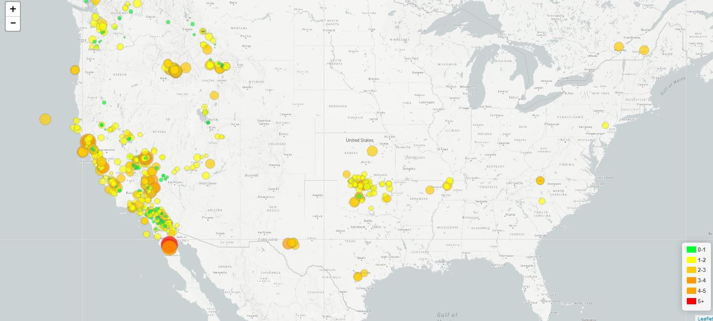

# Visualizing Earthquake data using Leaflet

<h3>Objective:</h3>
To visualize the past seven days earthquake data obtained from United States Geological Survey (USGS) on a leaflet map.
<h3>Data Source:</h3>
<a href="https://earthquake.usgs.gov/earthquakes/feed/v1.0/geojson.php">USGS GeoJSON Feed</a>
<h3>Overview</h3>
Created a map using Leaflet that plots all of the earthquakes from the data set based on their longitude and latitude with the following specifications:

1. The data markers reflect the magnitude of the earthquake in their size and color. Earthquakes with higher magnitudes appear larger and darker in color.
2. Include popups that provide the magnitude and epicenter of the earthquake when a marker is clicked.
3. A legend that provides context of the map data.
  

